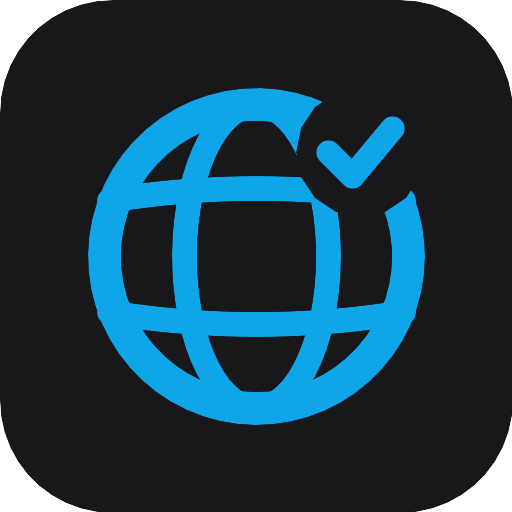

# Ownlate

**Translation management platform for teams that ship fast**

Real-time collaborative editor · Translation memory · Machine translation · Git sync · CLI

[Platform](https://platform.ownlate.com) · [Docs](https://docs.ownlate.com) · [Website](https://ownlate.com)

---

## Overview

Ownlate centralises your localisation workflow in one place. Translators work in a real-time editor, developers push and pull files via CLI or API, and quality gates — translation memory, QA rules, review approval — keep every language consistent.

---

## Features

### Collaborative editor

- Real-time presence — see who's editing which segment
- 7-state workflow: untranslated → draft → in progress → needs review → reviewed → approved → outdated
- Plural form editor (zero / one / two / few / many / other)
- Markdown and MDX document mode
- Translation history per segment · Inline comments

### Translation Memory & Machine Translation

- Auto-fill from previously approved translations with fuzzy matching
- Configurable similarity threshold (0–100%)
- Pre-translate entire projects via TM, MT, or both in one run
- **6 MT / AI providers** — OpenAI (GPT-4o), Anthropic Claude, DeepL, Google Translate, Azure Translator, Mistral
- Custom system prompts per AI provider

### Quality Assurance

- Built-in checks: interpolation variables, HTML tags, trailing whitespace, missing terms
- Custom regex rules at workspace level with error / warning severity
- Glossary with forbidden terms — flagged automatically during translation
- Live QA panel in the editor, no separate review step needed

### File formats

JSON · YAML · PO (gettext) · Markdown · MDX — nested folder structures with arbitrary depth, auto-parsed on upload.

### Integrations

| Category            | Providers                                                             |
| ------------------- | --------------------------------------------------------------------- |
| Machine Translation | OpenAI, Anthropic, DeepL, Google Translate, Azure Translator, Mistral |
| Version Control     | GitHub, GitLab, Bitbucket                                             |
| Notifications       | Slack, Teams, Discord, Mattermost, Matrix, Telegram                   |
| Cloud Storage       | AWS S3, Google Cloud Storage                                          |
| Webhooks            | Generic webhook with event filtering                                  |

VCS integrations sync source strings and open pull requests with approved translations automatically.
